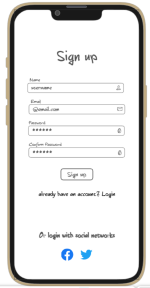
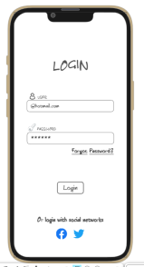
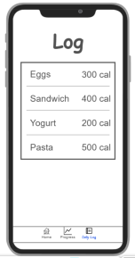

# Calorie Tracker

[My Notes](notes.md)

An app to record meals eaten and calories per day with functionality to track weekly progress and view past logs. 

> [!NOTE]
>  This is a template for your startup application. You must modify this `README.md` file for each phase of your development. You only need to fill in the section for each deliverable when that deliverable is submitted in Canvas. Without completing the section for a deliverable, the TA will not know what to look for when grading your submission. Feel free to add additional information to each deliverable description, but make sure you at least have the list of rubric items and a description of what you did for each item.

> [!NOTE]
>  If you are not familiar with Markdown then you should review the [documentation](https://docs.github.com/en/get-started/writing-on-github/getting-started-with-writing-and-formatting-on-github/basic-writing-and-formatting-syntax) before continuing.

## 🚀 Specification Deliverable

> [!NOTE]
>  Fill in this sections as the submission artifact for this deliverable. You can refer to this [example](https://github.com/webprogramming260/startup-example/blob/main/README.md) for inspiration.

For this deliverable I did the following. I checked the box `[x]` and added a description for things I completed.

- [x] Proper use of Markdown
- [x] A concise and compelling elevator pitch
- [x] Description of key features
- [x] Description of how you will use each technology
- [x] One or more rough sketches of your application. Images must be embedded in this file using Markdown image references.

### Elevator pitch

Whether it's to gain, lose, or maintain weight a lot of us, myself included, track the calories we eat in a day so that we can meet our goals. It's a huge pain to have to go write down every food you ate that day and look up the calorie count for each food item and I often find myself forgetting to write things down and getting an inaccurate calorie count at the end of the day. It would be so much easier if there was an app on your phone that you could use to quickly search foods and automatically add them and their corresponding calorie count to your daily total. Such an app would also make it so much easier to track your progress long term by storing your data and providing visuals. 

### Design

### Key features

- Daily calorie log
- Weekly progress tracking 
- Food database integration (Food API)
- User authentication
- A database that stores user info
- Realtime updates when goals are met and fod is logged

### Technologies

I am going to use the required technologies in the following ways.

- **HTML** - Structure for a signup/login page, a home page, daily log page, and progress page.
- **CSS** - Style for different screen sizes, style buttons and potentially add animations when switching pages or logging meals.
- **React** - Use for login, daily meal log, meal logging form, and progress graph.
- **Service** - Use a food API with data on food and colorie information.
- **DB/Login** - Register and login the user, store user data (meals logged, calorie totals).
- **WebSocket** - Notify user in real time when a meal is logged or the calorie goal is met.

## 🚀 AWS deliverable

For this deliverable I did the following. I checked the box `[x]` and added a description for things I completed.

- [x] **Server deployed and accessible with custom domain name** - [My server link](https://calorietracker.click).

## 🚀 HTML deliverable

For this deliverable I did the following. I checked the box `[x]` and added a description for things I completed.

- [x] **HTML pages** - I created four html pages: index.html, tracker.html, progress.html, and log.html.
- [x] **Proper HTML element usage** - I employed proper usage of Head, Header, Body, Main, Footer, Div, etc. elements.
- [x] **Links** - I included links to navigate between each of the pages.
- [x] **Text** - I added text when necessary both as placeholders for database elements and general headings and subheadings for the final webpage.
- [x] **3rd party API placeholder** - I included a search bar titled "Search Food" that will connect to a food database API to allow users to search for nutrition information for different foods. 
- [x] **Images** - I added images.
- [x] **Login placeholder** - I included a login placeholder.
- [x] **DB data placeholder** - I included database placeholder text on the "Daily Log" page.
- [x] **WebSocket placeholder** - I added a placeholder for the websocket notifications on the "Tracker" page.

## 🚀 CSS deliverable

For this deliverable I did the following. I checked the box `[x]` and added a description for things I completed.

- [x] **Header, footer, and main content body** - Used CSS to size header and footer elements and add background colors and images.
- [x] **Navigation elements** - Used CSS to style nav elements with hover properties and customized coloring.
- [x] **Responsive to window resizing** - Styled elements so they would stop getting larger at certain points and only get so small.
- [x] **Application elements** - I used a combination of CSS and Bootstrap to style my application elements and make them more user friendly. 
- [x] **Application text content** - Used CSS to make text readable and flow with the layout of the website.
- [x] **Application images** - Used images to improve visual asthetics including a background image for the home page. 

## 🚀 React part 1: Routing deliverable

For this deliverable I did the following. I checked the box `[x]` and added a description for things I completed.

- [X] **Bundled using Vite** - I installed Vite.
- [X] **Components** - I created a component for each page of my application.
- [X] **Router** - I implemented routing between the different components.

## 🚀 React part 2: Reactivity

For this deliverable I did the following. I checked the box `[x]` and added a description for things I completed.

- [x] **All functionality implemented or mocked out** - I implemented/mocked out all fuctionality.
- [x] **Hooks** - I implemented useEffect and useState hooks.

## 🚀 Service deliverable

For this deliverable I did the following. I checked the box `[x]` and added a description for things I completed.

- [x] **Node.js/Express HTTP service** - I used Node.js and Express.
- [x] **Static middleware for frontend** - I added static middleware for frontend.
- [x] **Calls to third party endpoints** - I included calls to third party endpoints.
- [x] **Backend service endpoints** - I added backend service endpoints.
- [x] **Frontend calls service endpoints** - My frontend calls service endpoints.

## 🚀 DB/Login deliverable

For this deliverable I did the following. I checked the box `[x]` and added a description for things I completed.

- [x] **User registration** - Registers users and stores info in mongodb.
- [x] **User login and logout** - Searches mongodb for user info to login existing users.
- [x] **Stores data in MongoDB** - Stores user input (calorie data) in mongodb.
- [x] **Stores credentials in MongoDB** - Stores login credentials in mongodb.
- [x] **Restricts functionality based on authentication** - Only allows users to navigate past login if they are authenticated.

## 🚀 WebSocket deliverable

For this deliverable I did the following. I checked the box `[x]` and added a description for things I completed.

- [ ] **Backend listens for WebSocket connection** - I did not complete this part of the deliverable.
- [ ] **Frontend makes WebSocket connection** - I did not complete this part of the deliverable.
- [ ] **Data sent over WebSocket connection** - I did not complete this part of the deliverable.
- [ ] **WebSocket data displayed** - I did not complete this part of the deliverable.
- [ ] **Application is fully functional** - I did not complete this part of the deliverable.
